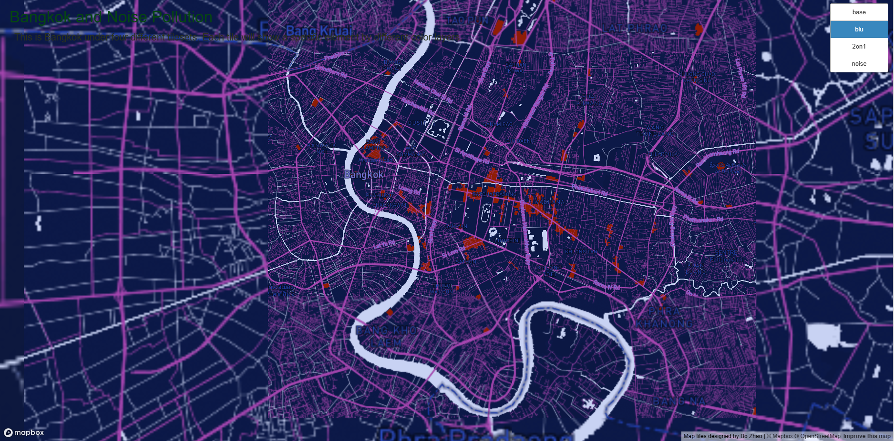

# Map-Design-and-Tile-Generation
## Bangkok 
In this lab, I design a web map with 4 tilesets.
[Bangkok Web Map Page](http://127.0.0.1:5502/index.html)

All the map below was scaled as 1:27036 with the Mecator map projection EPSG: 3857

### 1: Base map
The base map is monochrome style with very light color. This is super boring to me, so I made a little edits on it. 
From this 

To this 

I actually just change the color of the water and add some green landscape.

### 2: Thematic layer
For this task, I just create another monochrome with dark blue for the base, also highlight the road and water, building, commercial place. 

### 3: Composed of the thematic layer
In order to make the second tile on the first tile. I keep the base as tile 1, on keep highlight data of tile 2 on this map.

### 4: Map layer designed over Mapbox
The data input was made from Mapbox datasets and import to this map. The yellow dot show places have noise pollution in Bangkok. 
 